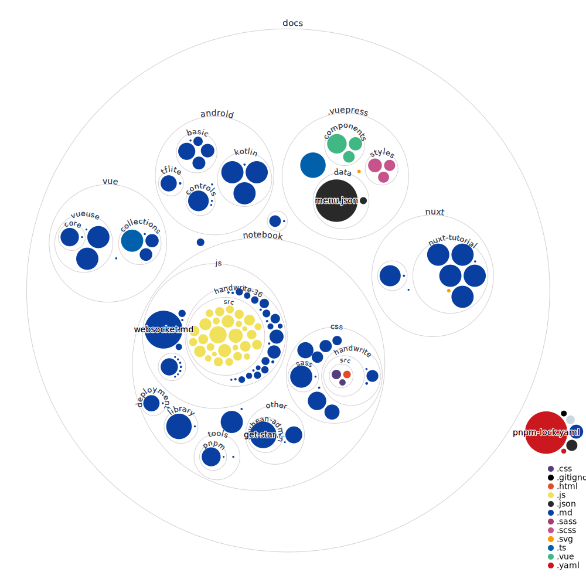

# VuePress Frontend Notes | 前端笔记


🚀 [Online Reading](https://blog.alexsun.top/vuepress-frontend-notes/) | [在线阅读](https://blog.alexsun.top/vuepress-frontend-notes/).



## 📖 Introduction | 介绍

Frontend notes, including various frontend learning notes, and some frontend project practices. | 前端笔记，包含各种前端学习笔记，以及一些前端项目的实践。

It is recommended to install the **markdownlint** plugin to format the MarkDown file. | 建议安装插件 **markdownlint** 来格式化 MarkDown 文件。

This project uses the project structure diagram generated by [Repo Visualization](https://githubnext.com/projects/repo-visualization/). | 本项目使用 [Repo Visualization](https://githubnext.com/projects/repo-visualization/) 生成的项目结构图。

## 🛠️ Build Docs | 构建文档

Build with `pnpm`, the content will be generated in `docs/.vuepress/dist`. | 使用 `pnpm` 构建， 内容将生成在 `docs/.vuepress/dist` 下:

```bash
pnpm i
pnpm build
```

Build with Docker | 使用 Docker 构建:

```bash
docker build -t vuepress-frontend-notes .
docker run -itd -p 80:80 vuepress-frontend-notes
```

Now you can visit <http://localhost> to see your docs. | 现在你可以访问 <http://localhost> 来查看你的文档。

## 📜 License | 开源协议

- All files except `/docs/*` are licensed under [MIT License](https://mit-license.org/) | 除了文档外的其他文件（除了 `/docs/` 文件夹），使用 [MIT 协议](https://mit-license.org/) 开源
- `/docs/*` are licensed under [CC-BY-NC-SA 4.0](https://creativecommons.org/licenses/by-nc-sa/4.0/) | 文档（即 `/docs/` 下的文件）使用 [CC-BY-NC-SA 4.0](https://creativecommons.org/licenses/by-nc-sa/4.0/) 共享

For more details, please read [this series of documents license](https://github.com/Sun-ZhenXing/Sun-ZhenXing.github.io#%E5%BC%80%E6%BA%90%E5%8D%8F%E8%AE%AE). | 详情请阅读 [此系列文档开源协议](https://github.com/Sun-ZhenXing/Sun-ZhenXing.github.io#%E5%BC%80%E6%BA%90%E5%8D%8F%E8%AE%AE)。
