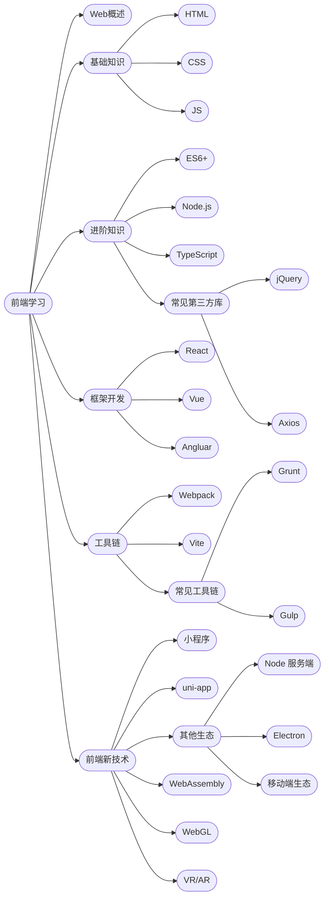

# 前端路线图

```mermaid
graph LR
    ROOT(["前端学习"])
    A(["Web概述"])
    B(["基础知识"])
        B1(["HTML"])
        B2(["CSS"])
        B3(["JS"])
    C(["进阶知识"])
        C1(["ES6+"])
        C2(["Node.js"])
        C3(["TypeScript"])
        C4(["常见第三方库"])
            C41(["jQuery"])
            C42(["Axios"])
    D(["框架开发"])
        D1(["React"])
        D2(["Vue"])
        D3(["Angluar"])
    E(["工具链"])
        E1(["Webpack"])
        E2(["Vite"])
        E3(["常见工具链"])
            E31(["Grunt"])
            E32(["Gulp"])
    F(["前端新技术"])
        F1(["小程序"])
        F2(["uni-app"])
        F3(["其他生态"])
            F31(["Node 服务端"])
            F32(["Electron"])
            F33(["移动端生态"])
        F4(["WebAssembly"])
        F5(["WebGL"])
        F6(["VR/AR"])

    ROOT --> A & B & C & D & E & F
    B --> B1 & B2 & B3
    C --> C1 & C2 & C3 & C4
    C4 --> C41 & C42
    D --> D1 & D2 & D3
    E --> E1 & E2 & E3
    E3 --> E31 & E32
    F --> F1 & F2 & F3 & F4 & F5 & F6
    F3 --> F31 & F32 & F33
```
