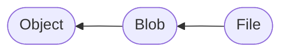

# 1. File 和 Blob 简介

## 1.1 Blob 对象

[`Blob`](https://developer.mozilla.org/zh-CN/docs/Web/API/Blob) 对象表示一个不可变、原始数据的类文件对象。它的数据可以按文本或二进制的格式进行读取，也可以转换成 [`ReadableStream`](https://developer.mozilla.org/zh-CN/docs/Web/API/ReadableStream) 来用于数据操作。[^1]

[^1]: MDN，<https://developer.mozilla.org/zh-CN/docs/Web/API/Blob>

`Blob` 更通俗的解释是大二进制对象。创建 `Blob` 对象的代码如下：

```js
const blob = new Blob(['Hello, world!']);
```

创建文件对象的代码如下，区别是文件必须要指定文件名称，而文件对象并不一定代表文件系统上的一个文件，它只是一个表示：

```js
const file = new File(['Hello, world!'], 'hello.txt');
```

[`File`](https://developer.mozilla.org/zh-CN/docs/Web/API/File) 在 Node 端不可用，Node 端有自己的 FS 实现，而 Node 端可以使用 `Blob`。

`File` 类型继承于 `Blob` 类型：



所以 `Blob` 的方法在 `File` 中都存在。

`Blob` 可以获取 [`ArrayBuffer`](https://developer.mozilla.org/zh-CN/docs/Web/JavaScript/Reference/Global_Objects/ArrayBuffer) 对象：

```js
const arrayBuffer = await blob.arrayBuffer()
```

## 1.2 FileReader 对象

文件还有一个特殊的工具 [`FileReader`](https://developer.mozilla.org/zh-CN/docs/Web/API/FileReader) 用于读取文件，当一个读取事件结束时，它会调用 `onload` 函数来传递参数。`FileReader` 同样在 Node 端不可用。

```js
const fileReader = new FileReader();
fileReader.onload = (event) => {
    console.log(fileReader.result);     // ArrayBuffer(13)
    console.log(event.target.result);   // ArrayBuffer(13)
}
fileReader.readAsArrayBuffer(file);
```

我们调试后可以看到，`fileReader.result` 和 `event.target.result` 值是一样的。

## 1.3 DateView 对象

[`DataView`](https://developer.mozilla.org/en-US/docs/Web/JavaScript/Reference/Global_Objects/DataView) 对象用于查看或修改 `ArrayBuffer` 对象的内容。

```js
const arrayBuffer = await blob.arrayBuffer();
const dataView = new DataView(arrayBuffer);

console.log(dataView);
console.log(dataView.getUint8(0)); // 72
dataView.setUint8(0, 104);
```

`DataView` 对象有很多 `set` 或者 `get` 开头的方法，用于获取指定位置或修改指定位置的数据。
