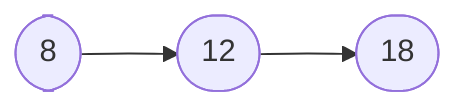
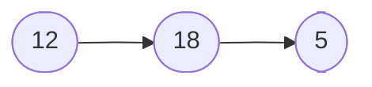
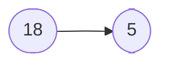
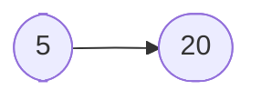

# JavaScript 中的任务和微任务

[[TOC]]

## 1. 引入

在下面的代码中，输出的顺序是怎样的？

@[code js](./src/microtask1.js)

下面我们执行代码：

```bash
node docs/notebook/js/src/microtask1.js
```

我们可以得到如下的输出：

```js
0
1
2
1-1
1-2
2-1
2-2
```

如果需要仔细理解上述代码的执行过程，需要详细了解 JavaScript 中的任务和微任务。

有的地方将 **任务**（Task）称为 **宏任务**（MacroTask），本文只引用专业材料故只使用 **任务** 这一术语。

## 2. 任务和微任务

### 2.1 任务

一个任务就是由执行诸如从头执行一段程序、执行一个事件回调或一个 `setInterval` / `setTimeout` 被触发之类的标准机制而被调度的任意 JavaScript 代码。这些都在 **任务队列**（Task Queue）上被调度。[^1]

[^1]: 在 JavaScript 中通过 queueMicrotask() 使用微任务，MDN，<https://developer.mozilla.org/zh-CN/docs/Web/API/HTML_DOM_API/Microtask_guide>

在以下时机，任务会被添加到任务队列：

1. 一段新程序或子程序被直接执行时（比如从一个控制台，或在一个 `<script>` 元素中运行代码）。
2. 触发了一个事件，将其回调函数添加到任务队列时。
3. 执行到一个由 `setTimeout()` 或 `setInterval()` 创建的事件，以致相应的回调函数被添加到任务队列时。

事件循环驱动你的代码按照这些任务排队的顺序，一个接一个地处理它们。在当前迭代轮次中，只有那些当事件循环过程开始时 已经处于任务队列中 的任务会被执行。其余的任务不得不等待到下一次迭代。

### 2.2 微任务

一个 **微任务**（MicroTask）就是一个简短的函数，当创建该微任务的函数执行之后，并且只有当 Javascript 调用栈为空，而控制权尚未返还给被 [用户代理](https://developer.mozilla.org/zh-CN/docs/Glossary/User_agent) 用来驱动脚本执行环境的事件循环之前，该微任务才会被执行。事件循环既可能是浏览器的主事件循环也可能是被一个 [Web Worker](https://developer.mozilla.org/zh-CN/docs/Web/API/Web_Workers_API) 所驱动的事件循环。这使得给定的函数在没有其他脚本执行干扰的情况下运行，也保证了微任务能在用户代理有机会对该微任务带来的行为做出反应之前运行。

JavaScript 中的 [`Promise`](https://developer.mozilla.org/zh-CN/docs/Web/JavaScript/Reference/Global_Objects/Promise) 和 [Mutation Observer API](https://developer.mozilla.org/zh-CN/docs/Web/API/MutationObserver) 都使用微任务队列去运行它们的回调函数，但当能够推迟工作直到当前事件循环过程完结时，也是可以执行微任务的时机。为了允许第三方库、框架、polyfill 能使用微任务，在 [`Window`](https://developer.mozilla.org/zh-CN/docs/Web/API/Window) 和 [`Worker`](https://developer.mozilla.org/zh-CN/docs/Web/API/Worker) 接口上暴露了 [`queueMicrotask()`](https://developer.mozilla.org/zh-CN/docs/Web/API/queueMicrotask) 方法。

### 2.3 任务和微任务的区别

首先它们有一些共同点，例如它们都由位于某个队列的 JavaScript 代码组成并在合适的时候运行。但是，只有在迭代开始时队列中存在的任务才会被事件循环一个接一个地运行，这和处理微任务队列是殊为不同的。

有两点关键的区别。

首先，每当一个任务存在，事件循环都会检查该任务是否正把控制权交给其他 JavaScript 代码。如若不然，事件循环就会运行微任务队列中的所有微任务。接下来微任务循环会在事件循环的每次迭代中被处理多次，包括处理完事件和其他回调之后。

其次，如果一个微任务通过调用 `queueMicrotask()` 向队列中加入了更多的微任务，则那些新加入的微任务会早于下一个任务运行。这是因为事件循环会持续调用微任务直至队列中没有留存的，即使是在有更多微任务持续被加入的情况下。

::: warning 微任务无限递归

因为微任务自身可以入列更多的微任务，且事件循环会持续处理微任务直至队列为空，那么就存在一种使得事件循环无尽处理微任务的风险。

:::

## 3. 一些练习

描述下列代码的输出结果。

@[code js](./src/microtask2.js)

::: details 点击查看答案

```js
3
1
2
4
```

:::

描述下列代码的输出结果。

@[code js](./src/microtask3.js)

::: details 点击查看答案

```js
sync
end
promise1
promise2
resolvePromise resolved
promise3
```

首先运行所有同步代码，然后运行微任务队列中的所有微任务。

初始的微任务队列如下，使用行号表示：



下面弹出 **任务 8**，由于 **任务 8** 中包含一个 `Promise.resolve`，然后将 **任务 5** 入队：



下面弹出 **任务 12**，打印 `promise1`，然后将 **任务 9** 入队：



下面弹出 **任务 18**，打印 `promise2`，然后将 **任务 20** 入队：



下面弹出 **任务 5**，打印 `resolvePromise resolved`，然后弹出 **任务 20**，打印 `promise3`。

:::
