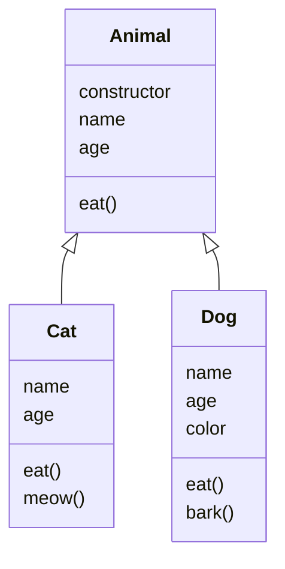

# 原型链

我们知道，对于 JS 创建对象有两种方式：

1. 过程式创建，就像上面一样，使用 `{}` 包围键值对来创建
2. 面向对象编程，使用包含 `this` 的函数作为类创建器

对于 ES6+，`class` 语法糖可以代替上述面向对象的创建方式，这种方式的本质仍然是第二种方式。

我们先复习一下面向对象编程：

设函数为 `f`，由此函数 `new` 所创建的三个对象 `a1`、`a2`、`a3`。

- `prototype` 是每个函数都拥有的属性，这个函数创建对象时将使用这个对象作为原型
- `__proto__` 和 `constructor` 是 `a1`、`a2`、`a3` 所拥有的属性
    - `__proto__` 指向对象的原型对象，原型对象通常和被 `new` 的对象结构一致
    - `constructor` 指向构造该对象的函数
- `a1.constructor === f`
- `a1.__proto__ === f.prototype`
