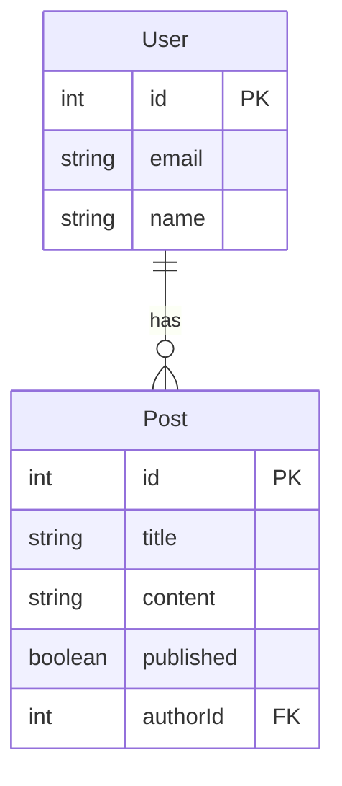

# Prisma 入门

[[TOC]]

## 1. 什么是 Prisma

Prisma 是一个开源的 ORM 框架，支持各类常见数据库系统，提供了数据模型、自动迁移、类型安全和自动补全支持，拥有活跃的社区和完善的支持。不同于传统的 ORM 框架，Prisma 使用了一些新方法来避免 ORM 的一些固有问题。

Prisma 现在不仅支持关系型数据库，也支持 NoSQL 数据库，如 MongoDB。此外还支持地理数据库 CockroachDB 等。

Prisma 适用于在各种架构中使用，如 REST API、GraphQL API、gRPC API 等。常见全栈应用：

- [Next.js](https://nextjs.org/)
- [Remix](https://remix.run/)
- [SvelteKit](https://kit.svelte.dev/)
- [Nuxt](https://nuxt.com/)
- [Redwood](https://redwoodjs.com/)
- [t3 stack — using tRPC](https://create.t3.gg/)

## 2. 开始使用

### 2.1 创建项目

下面我们将创建一个 TypeScript 项目和一个本地 SQLite 数据库，从头开始使用 Prisma。它包括数据建模、迁移和查询数据库。

```bash
mkdir hello-prisma
cd hello-prisma
```

下面我们将使用 `pnpm` 来创建和管理项目：

```bash
pnpm init
pnpm add -D typescript ts-node @types/node
```

初始化 TypeScript 项目：

```bash
npx tsc --init
```

添加 Prisma 依赖：

```bash
pnpm add -D prisma @prisma/client
```

使用 Prisma CLI 初始化项目，数据库为 SQLite：

```bash
npx prisma init --datasource-provider sqlite
```

现在我们已经创建了 `prisma/schema.prisma` 文件，它是 Prisma 的数据模型定义文件，我们可以在其中定义数据模型和数据源。如果你希望在已的数据库中逆向创建 Prisma 请参考 [官方文档：添加到已有项目](https://www.prisma.io/docs/getting-started/setup-prisma/add-to-existing-project)。

在 VS Code 中，我们可用使用插件 `Prisma.prisma` 获得 Prisma 的语法高亮和自动补全支持。

下面我们更新 `prisma/schema.prisma` 文件，定义数据模型：

```prisma
generator client {
  provider = "prisma-client-js"
}

datasource db {
  provider = "sqlite"
  url      = env("DATABASE_URL")
}

model User {
  id    Int     @id @default(autoincrement())
  email String  @unique
  name  String?
  posts Post[]
}

model Post {
  id        Int     @id @default(autoincrement())
  title     String
  content   String?
  published Boolean @default(false)
  author    User    @relation(fields: [authorId], references: [id])
  authorId  Int
}
```

上述模型非常直观，表述的模型结构如下：



### 2.2 数据迁移

现在你已经有了模型对象，但数据库中还没有对应结构。类似于 Django 的迁移，Prisma 也提供了迁移工具，可以将模型结构映射到数据库中。

在 `.env` 文件中，定义了数据库的连接信息：

```properties
DATABASE_URL="file:./dev.db"
```

如果你需要更改，可以在此处修改。

现在我们可以使用 Prisma CLI 来创建迁移文件：

```bash
npx prisma migrate dev --name init 
```

现在 SQLite 数据库中已经创建了对应的表结构。

### 2.3 查询数据库

我们验证一下数据库是否可用，创建 `script.ts` 文件：

```ts{6-13}
import { PrismaClient } from '@prisma/client'

const prisma = new PrismaClient()

async function main() {
  const user = await prisma.user.create({
    data: {
      name: 'Alice',
      email: 'alice@prisma.io',
    },
  })
  const users = await prisma.user.findMany()
  console.log(users)
}

main()
  .then(async () => {
    await prisma.$disconnect()
  })
  .catch(async (e) => {
    console.error(e)
    await prisma.$disconnect()
    process.exit(1)
  })
```

它将创建一个用户，并查询所有用户，我们运行一下：

```bash
npx ts-node script.ts
```

输出结果如下，表示我们已经成功连接到数据库：

```ts
[ { id: 1, email: 'alice@prisma.io', name: 'Alice' } ]
```

我们再插入一个用户，这时候我们使用关联字段创建一个 `Post` 对象：

```ts{2-6}
async function main() {
  const user = await prisma.user.create({
    data: {
      name: 'Bob',
      email: 'bob@prisma.io',
      posts: {
        create: {
          title: 'Hello World',
        },
      },
    },
  })
  const users = await prisma.user.findMany()
  console.log(users)
}
```

现在输出结果是：

```ts
[
  { id: 1, email: 'alice@prisma.io', name: 'Alice' },
  { id: 2, email: 'bob@prisma.io', name: 'Bob' }
]
```

我们注意到，`User` 对象中并没有 `Post` 成员，这是因为默认情况下，Prisma 只在查询的结果对象中返回 **标量** 字段。

为了同时检索属于一个用户的帖子记录，你可以通过帖子关系字段使用 `include` 选项：

```ts{2-6}
async function main() {
  const usersWithPosts = await prisma.user.findMany({
    include: {
      posts: true,
    },
  })
  console.dir(usersWithPosts, { depth: null })
}
```

此时我们已经能正确看到数据库中的关联信息：

```ts
[
  { id: 1, email: 'alice@prisma.io', name: 'Alice', posts: [] },
  {
    id: 2,
    email: 'bob@prisma.io',
    name: 'Bob',
    posts: [
      {
        id: 1,
        title: 'Hello World',
        content: null,
        published: false,
        authorId: 2
      }
    ]
  }
]
```

如果需要管理和可视化数据库中的信息，可用使用 Navicat 等工具。如果没有安装相应工具，Prisma 也提供了 Prism Studio 来支持简易地管理数据库：

```bash
npx prisma studio
```

现在打开 <http://localhost:5555>，即可看到数据库中的信息。

::: tip 更多信息

- [命令行参考](./cli.md)
- [官方文档：在项目中使用关系数据库或 MongoDB](https://www.prisma.io/docs/getting-started/setup-prisma/start-from-scratch)

:::
